# Cinema Booking System

A full-stack cinema booking platform with real-time seat selection, multi-step booking flow, email confirmations, and a complete admin dashboard. Runs entirely locally — no cloud services required.

## Tech Stack

| Layer | Technology |
|-------|-----------|
| **Frontend** | React, Vite, Tailwind CSS v4 |
| **Backend** | Node.js, Express |
| **Database** | SQLite (better-sqlite3) |
| **Auth** | JWT (bcryptjs) |
| **Email** | Nodemailer (Gmail SMTP, optional) |

## Features

### User-Facing
- Browse movies with posters, genre-colored badges, duration, and descriptions
- Filter showtimes by date using a dropdown date picker
- Interactive seat selection grid with 3 seat types: VIP (Row A), Couple (last 2 seats/row), Standard
- Add snacks (food, drinks, candy) during booking
- Multi-step booking flow: showtime → seats → snacks → payment → confirmation
- Email confirmation with booking details and QR-ready booking reference
- Cancel bookings (with 2-hour policy — late cancellations trigger account restriction)
- Star ratings and written reviews for movies you've watched
- Waitlist system — get notified when sold-out showtimes have cancellations
- Forgot password with email reset link

### Admin Dashboard
- Manage movies (add, edit, delete, toggle active/inactive)
- Manage showtimes (single or recurring — daily/weekly)
- Manage halls and seat configurations
- Manage snack menu with categories and pricing
- View and manage all bookings
- User management (edit roles, blacklist, delete)
- Book on behalf of users (walk-in customers)

### Security
- Gmail-only registration
- JWT authentication with role-based access control
- Blacklist system for policy violations
- Password reset via secure token

## Screenshots

### User Experience

| Homepage | Movie Detail & Date Picker |
|----------|---------------------------|
| 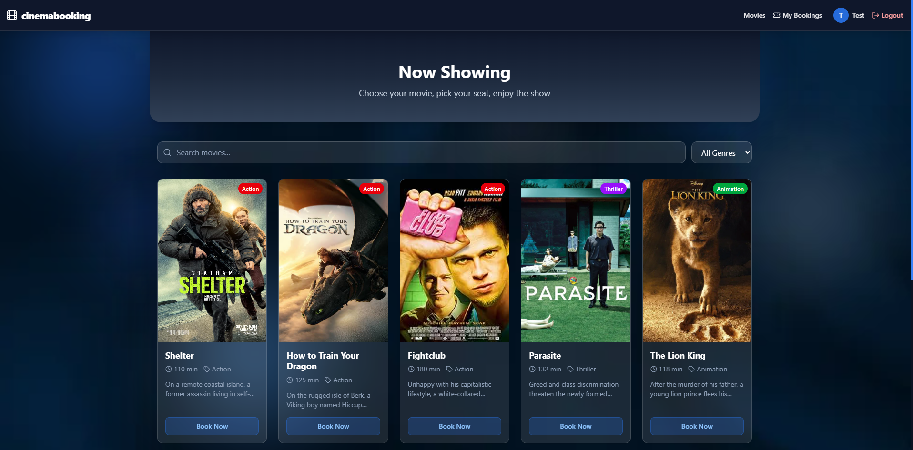 | 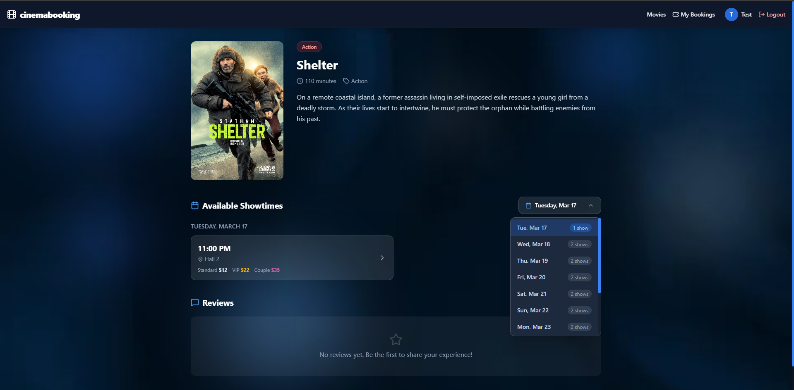 |

| Seat Selection | Snack Selection |
|---------------|-----------------|
| 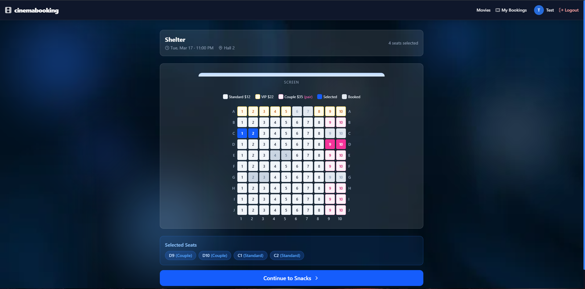 | 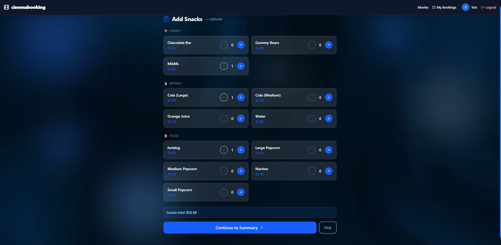 |

| Booking Confirmation | My Bookings |
|---------------------|-------------|
| 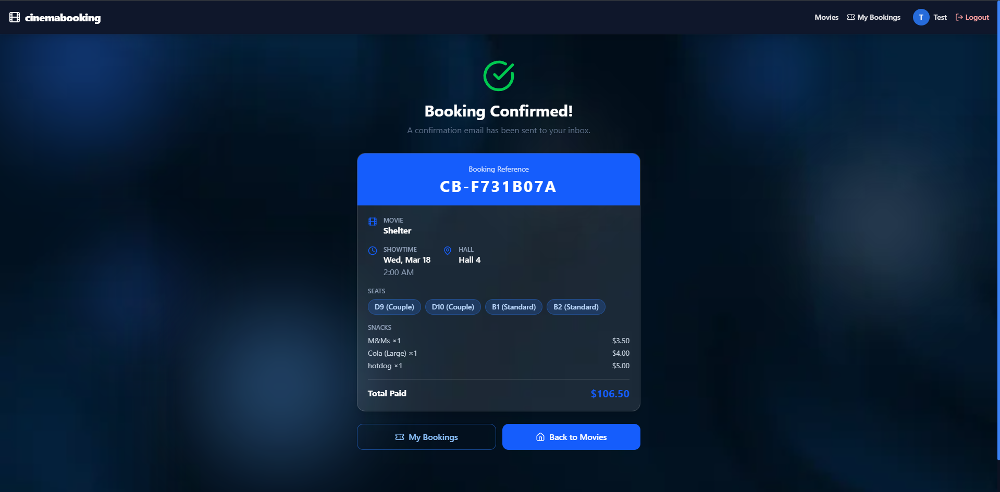 | 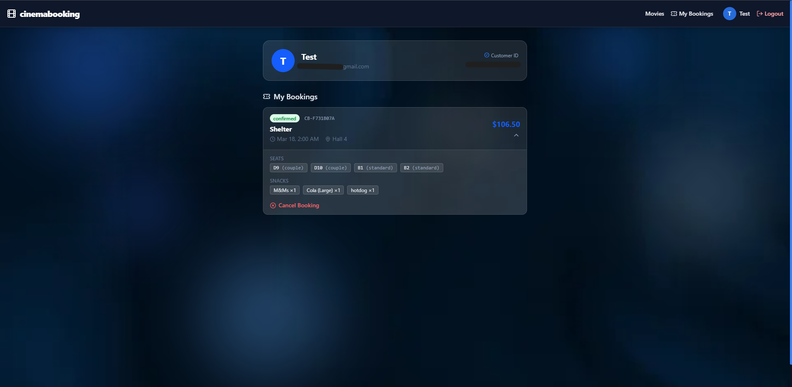 |

| Email Confirmation | Login |
|-------------------|-------|
| 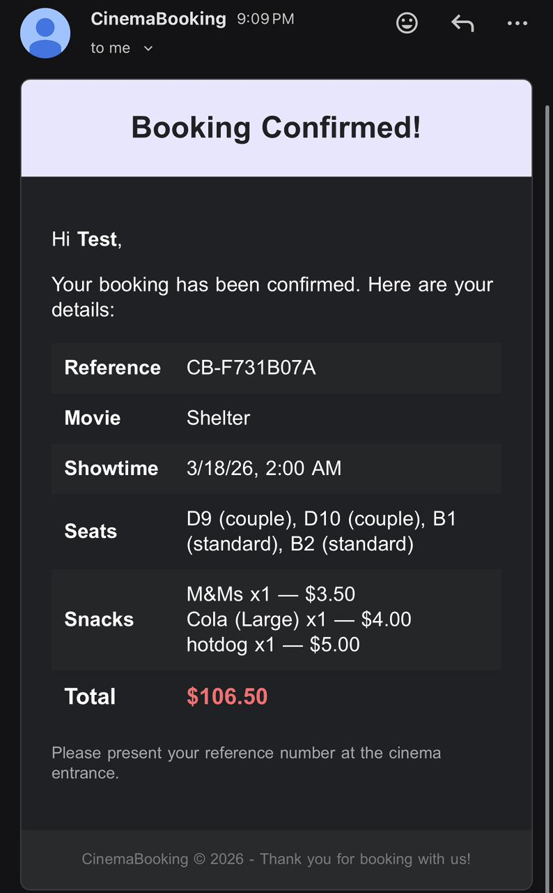 | 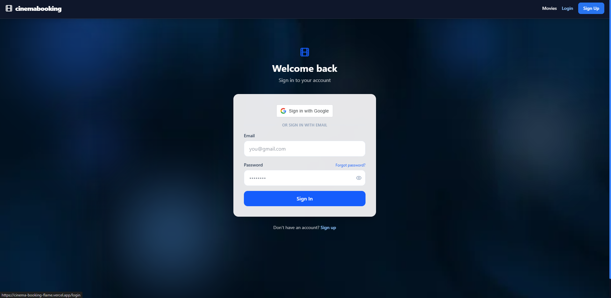 |

### Admin Dashboard

| Dashboard | Movies Management |
|-----------|-------------------|
| 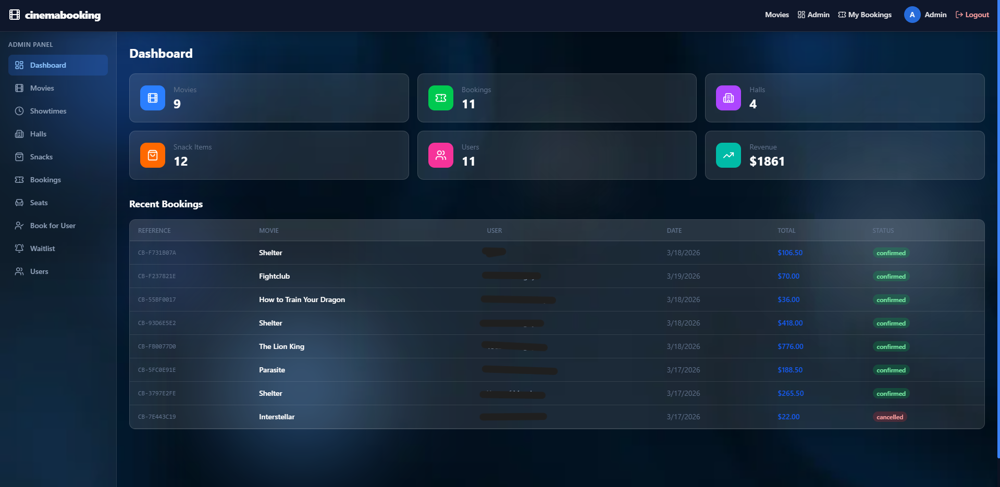 | 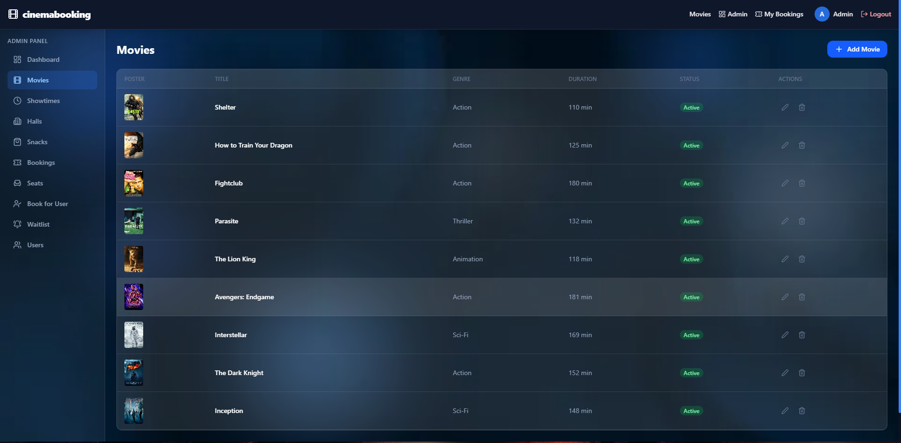 |

| Showtimes | Halls Management |
|-----------|-----------------|
| 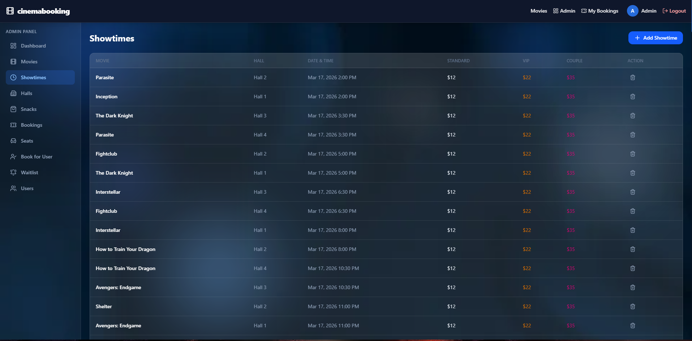 | 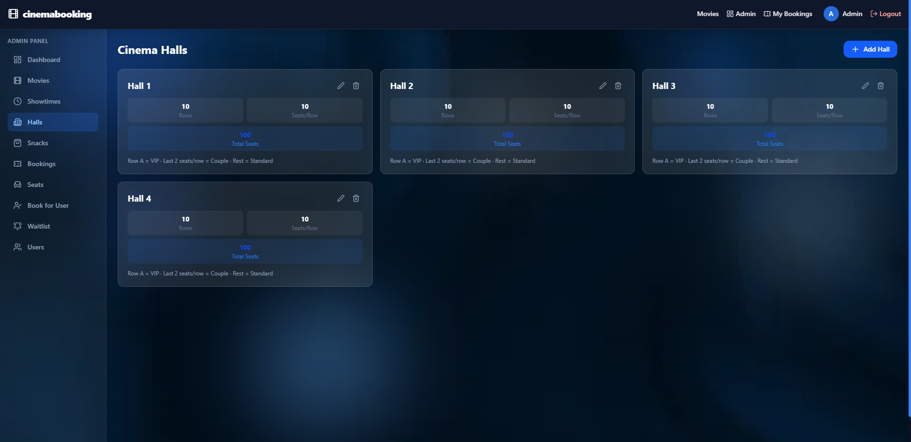 |

| Bookings Management | Seat Management |
|--------------------|-----------------|
| 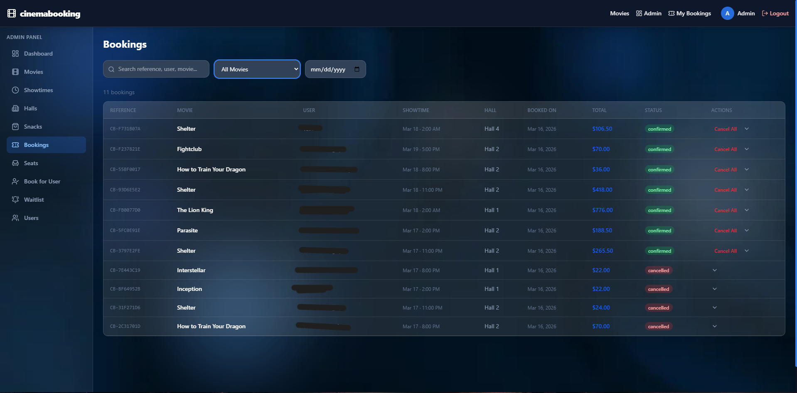 | 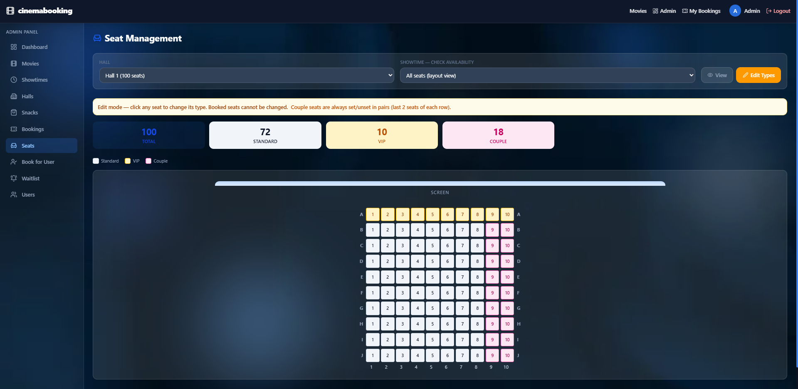 |

| Snacks Management | Book for User |
|-------------------|--------------|
| 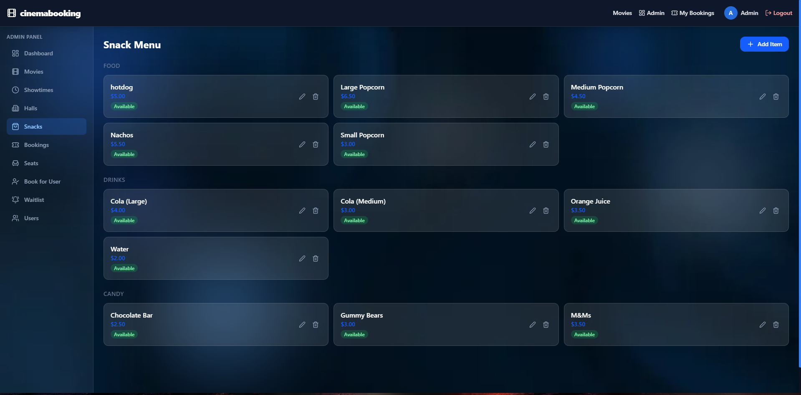 | 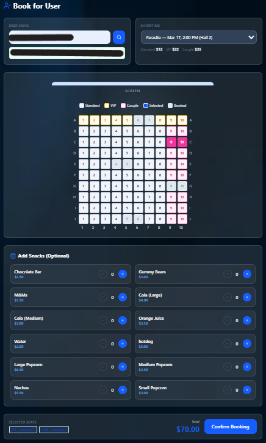 |

| Users Management | Waitlist |
|-----------------|----------|
| 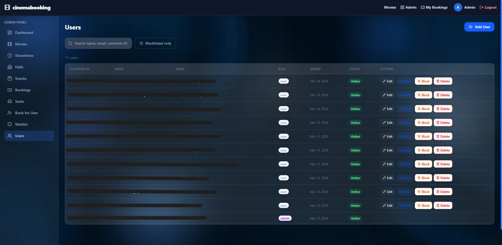 | 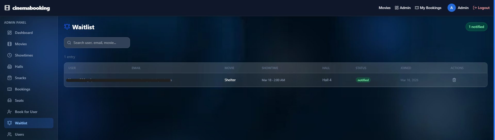 |

## Project Structure

```
├── backend/
│   ├── server.js            # Express entry point
│   ├── database.js          # SQLite connection + schema
│   ├── cinema.db            # SQLite database file (created on first run)
│   ├── routes/
│   │   ├── auth.js          # Login, register, forgot/reset password
│   │   ├── movies.js        # CRUD + reviews
│   │   ├── showtimes.js     # CRUD + recurring creation
│   │   ├── bookings.js      # Book, cancel, my bookings
│   │   ├── seats.js         # Seat availability per showtime
│   │   ├── snacks.js        # CRUD
│   │   ├── halls.js         # CRUD
│   │   ├── users.js         # Admin user management
│   │   └── waitlist.js      # Join/leave waitlist
│   └── utils/
│       ├── email.js         # Booking confirmation + reminder emails
│       ├── seed.js          # Seed movies, halls, snacks, demo users
│       └── seed-showtimes.js # Seed extra showtimes over a date range
├── frontend/
│   ├── src/
│   │   ├── pages/           # All route pages
│   │   ├── components/      # Reusable UI components
│   │   ├── context/         # Auth + Booking context providers
│   │   └── utils/           # Shared utilities (genre colors, etc.)
│   └── vite.config.js       # Dev proxy → backend
└── start.bat                # One-click local launcher (Windows)
```

## Getting Started

### First-time setup

```bash
# 1. Install backend dependencies
cd backend
npm install

# 2. Seed the database (creates cinema.db with demo data)
npm run seed

# 3. Install frontend dependencies
cd ../frontend
npm install
```

### Running

```bash
# Terminal 1 — Backend
cd backend
npm start          # runs on http://localhost:5000

# Terminal 2 — Frontend
cd frontend
npm run dev        # runs on http://localhost:5173, proxies /api → backend
```

Or on Windows, just double-click `start.bat` to launch both.

### Demo Credentials

- **Admin:** `admin@cinema.com` / `admin123`
- **User:** `john@example.com` / `user123`

### Environment Variables (backend/.env, optional)

The app runs without any `.env` file. Everything below is optional:

```
JWT_SECRET=anything_you_want        # defaults to a placeholder
ADMIN_PASSWORD=your_admin_password  # defaults to 'admin123' — used when seeding
EMAIL_USER=your_gmail@gmail.com     # optional — enables email confirmations
EMAIL_PASS=your_gmail_app_password  # optional
DISPLAY_TIMEZONE=Asia/Dubai         # defaults to Asia/Dubai
```

Email is non-blocking — bookings work fine without email configured.
